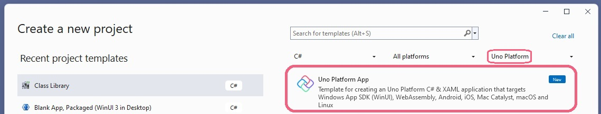
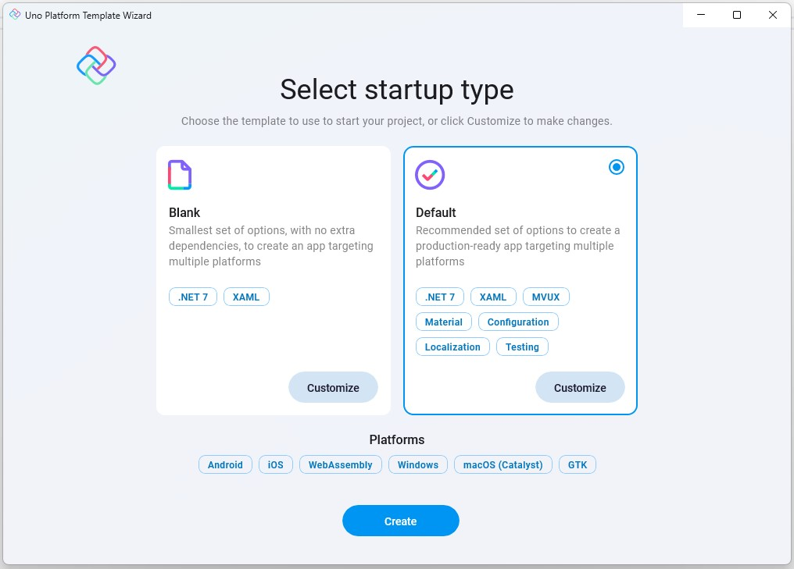

# Using the Project Template Wizard

## Getting started

The [Uno Platform Visual Studio extension](https://marketplace.visualstudio.com/items?itemName=unoplatform.uno-platform-addin-2022), provides project templates for the open source Uno Platform with which you can create single-source code, cross-platform solution and choose from the platforms to target: iOS, Android, WebAssembly, macOS, mac Catalyst, Windows and Linux.

After having installed the required workloads and the extension (use [Uno-Check](xref:UnoCheck.UsingUnoCheck) to verify that your environment is Uno Platform ready), search and click the Uno Platform App in your new project to open the wizard.

When prompted, configure the project and solution name and select the location to which the files should be saved, and click Create or hit <kbd>Enter</kbd>.

## Selecting startup type

The main page of the wizard shows and the default template is selected.

Click "Create" or hit <kbd>Enter</kbd> to accept the selected choice and generate the project, or select the blank template.
The *Customize* button lets you customize the selected template and fine tune which features should be included with the generated project.  
When clicking *Customize*, a wizard opens with the pre-selected settings per the choice in the first page (*Blank* or *Default*).

## Project configuration wizard

Throughout the wizard you can configure the following options, but you can click *Create* at any time to complete the project generation.  
Clicking *Cancel* returns to the [main page](#selecting-startup-type).

1. [Framework](#framework)
1. [Platforms](#platforms)
1. [Presentation](#presentation)
1. [Markup](#markup)
1. [Themes](#themes)
1. [Extensions](#extensions)
1. [Projects](#projects)
1. [Features](#features)
1. [Authentication](#authentication)
1. [Application](#application)
1. [Testing](#testing)

<!-- do not delete this line - it ends previous list -->

1. ### Framework

    This setting lets you choose the .NET version to target. The default is .NET 7.0, but you can change it to .NET 6.0, and even .NET 8.0!

1. ### Platforms

    This setting lets you choose which platforms the generated app will target.
    
    
    
    Uno Platform currently supports targeting the following operating systems:
    
    - Mobile
      - Android
      - iOS
    - Web
      - WebAssembly (WASM)
    - Desktop
      - macOS (via Catalyst)
      - Windows
      - GTK
      - WPF
      - Linux Framebuffer

1. ### Presentation

    This setting allows you to choose between MVVM and and MVUX.
    
    - **MVUX**  
    This generates a project with the new MVUX packages installed.
    MVUX stands for Model-View-Update-Extended is Uno Platform's new architecture of utilizing its powerful ode-generation engine to adapt mutability and data-binding, and providing tools to make it easier to anage asynchronous data requests both in the presentation layer as well as the UI layer.
    MVUX also adds support 
    
    - **MVVM**  
    Generates a project optimized for use with the traditional MVVM architecture.

1. ### Markup

    Determines the language used for UI markup.

    - **XAML**  
    Uses traditional WinUI XAML markup.

    - **C# Markup**  
    Uses the new C# Markup.  
    C# Markup is a new way of defining the UI tree in C# rather than XAML.  
    Learn more about C# Markup [here]().

1. ### Themes

    Sets the theme to be used in the generated app. The options available are:
    
    - **Fluent**  
    Fluent is an open-source design system that drives Windows and WinUI's default style.  
    Learn more about [Fluent Design System](https://www.microsoft.com/design/fluent/).
    
    - **Material**  
    Material is Google's design system.  
    Learn more about [Material](https://material.io/).

1. ### Extensions

    Enables setting which Uno Extensions should be included with the generated projects.
    Uno Extensions is a set of Extensions that cover common essentials application core building blocks, and are supported on all operating systems Uno Platform targets.  
    The Uno.Extensions follows the Microsoft.Extensions model that creates a host environment where you can register additional dependencies. The registered dependencies are then available throughout the application via the Services (`IServiceProvider`) property on the `IHost` instance.
    
    To learn more about Uno Extensions, visit [this page](xref:Overview.Features).
    
    The available extensions are:
    
    - General
      - **Dependency Injection**  
        This extension brings the power of [Microsoft Extensions Dependency Injection](https://learn.microsoft.com/en-us/dotnet/core/extensions/dependency-injection) to all OSs Uno Platform targets, and adds its additional functionality.  
        Refer to the [Uno Dependency Injection](xref:Overview.DependencyInjection) documentation for more information.
      - **Configuration**  
        This extension provides a way to load application configuration data from and to various sources using the [Options Pattern](https://learn.microsoft.com/en-us/dotnet/core/extensions/options).  
        Refer to the [Uno Configuration](xref:Overview.Configuration) documentation for more information.
      - **HTTP**  
        Uno HTTP extensions enables mapping different `HttpClient` configurations to different API endpoints.  
        Refer to the [Uno HTTP](xref:Overview.Http) documentation for more information.
      - **Localization**  
        The Localization extension ports [Microsoft.Extensions.Localization](https://learn.microsoft.com/en-us/dotnet/core/extensions/localization) to all OSs supported by Uno Platform.  
        Refer to the [Localization](xref:Overview.Localization) documentation for more information.
    - Navigation
      - **Regions**
        Uses Uno's Region navigation.
        A Region is the abstraction of the view responsible for handling navigation. Regions are structured into a logical hierarchical representation that shadows the navigation-aware controls in the visual hierarchy. The hierarchy allows navigation requests to be propagated up to parent and down to child regions as required.  
        Refer to the [Navigation](xref:Overview.Navigation) documentation for more information.
      - **Blank**  
        Provides the default [WinUI frame navigation](https://learn.microsoft.com/en-us/uwp/api/windows.ui.xaml.controls.frame).
    - Logging  
      Uno Platform's Logging Extension adapts [Microsoft Logging Extension](https://learn.microsoft.com/en-us/dotnet/core/extensions/logging) to Uno Platform apps.  
      - **Console**  
      Generates an app configured to write debug-level logging information to the Console.
      - **Default**  
      Generates an app that uses Dependency Injection to configure logging that writes output to Console.
      - **Serilog**  
      Generates an app that uses Dependency Injection to configure logging with [Serilog](https://github.com/serilog/serilog).

      Refer to the [Logging](xref:Overview.Logging) documentation for more information.
    - Authentication  
      Authentication has its dedicated tab, [see below](#authentication).

1. ### Projects

    - **Server**  
    Adds an ASP.NET Core Server projects to the solution, which hosts the WASM project, and can also be used to create an API and endpoints.

1. ### Features

    - **Toolkit**  
    Installs the [Uno.Toolkit](https://github.com/unoplatform/uno.toolkit.ui) package in the project, this package adds a set of custom controls, behaviors, extensions and other utilities to Uno Platform projects that are not offered out-of-the-box by WinUI. This includes [`Card`](https://github.com/unoplatform/uno.toolkit.ui/blob/main/src/Uno.Toolkit.UI/Controls/Card/Card.cs), [`TabBar`](https://github.com/unoplatform/uno.toolkit.ui/blob/main/src/Uno.Toolkit.UI/Controls/TabBar/TabBar.cs), [`NavigationBar`](https://github.com/unoplatform/uno.toolkit.ui/blob/main/src/Uno.Toolkit.UI/Controls/NavigationBar/NavigationBar.cs) and others.  
    - **PWA Manifest**  
    Includes a PWA ([Progressive Web Apps](https://learn.microsoft.com/en-us/microsoft-edge/progressive-web-apps-chromium)) manifest that enables installed the WASM web-target as an app in the running device.

    - **Visual Studio Code debugging**  
    Enables debugging the Web-Assembly and Skia heads in Visual Studio Code.

1. ### Authentication

    - **None**  
    Excludes authentication features from the generated projects.

    - **Custom**  
    Adds Uno Platform's [Custom Authentication](xref:Learn.Tutorials.Authentication.HowToAuthentication) support to the generated project.

1. ### Application

    Sets the iOS/macOS application [Bundle ID](https://developer.apple.com/documentation/appstoreconnectapi/bundle_ids) to be used in the App Store.

1. ### Testing

    - **Unit tests**  
    Adds an [NUnit](https://nunit.org) test project that targets the main (shared) head project.  
    The project also comes with [FluentAssertions](https://fluentassertions.com) pre-installed.

    - **UI tests**  
    Adds an NUnit-powered test app that provides UI testing capabilities using Uno Platform's UI testing tools (Uno.UITest).  
    To learn more about UI Testing in Uno Platform apps, read [this](xref:Uno.UITest.GetStarted).
