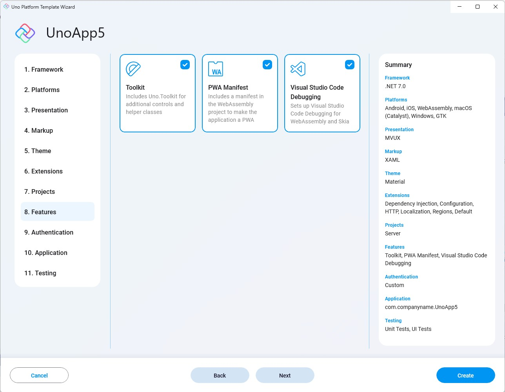

- **Toolkit**  
Installs the [Uno.Toolkit](https://github.com/unoplatform/uno.toolkit.ui) package in the project, this package adds a set of custom controls, behaviors, extensions and other utilities to Uno Platform projects that are not offered out-of-the-box by WinUI. This includes [`Card`](https://github.com/unoplatform/uno.toolkit.ui/blob/main/src/Uno.Toolkit.UI/Controls/Card/Card.cs), [`TabBar`](https://github.com/unoplatform/uno.toolkit.ui/blob/main/src/Uno.Toolkit.UI/Controls/TabBar/TabBar.cs), [`NavigationBar`](https://github.com/unoplatform/uno.toolkit.ui/blob/main/src/Uno.Toolkit.UI/Controls/NavigationBar/NavigationBar.cs) and others.

- **PWA Manifest**  
Includes a PWA ([Progressive Web Apps](https://learn.microsoft.com/en-us/microsoft-edge/progressive-web-apps-chromium)) manifest that enables easy-installation of the WASM web-target as an app in the running device.

- **Visual Studio Code debugging**  
Enables debugging the Web-Assembly and Skia heads in Visual Studio Code.

