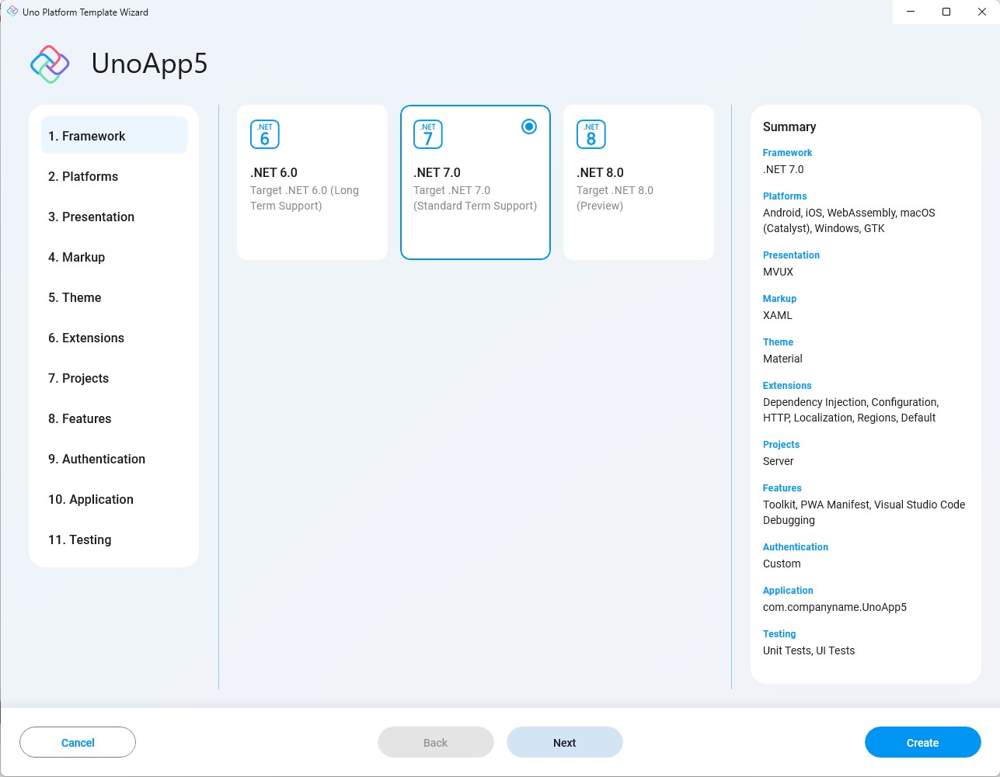

This setting lets you choose the .NET version to target. The default is .NET 7.0, but you can change it to .NET 6.0, and even .NET 8.0!

[.NET 7](https://learn.microsoft.com/en-us/dotnet/core/whats-new/dotnet-7) has introduced a myriad of improvements in performance and other aspects and is the current recommended .NET version.  
[.NET 8](https://learn.microsoft.com/en-us/dotnet/core/whats-new/dotnet-8) adds further performance improvements as well as other general enhancements.

Though in some cases you would still want to use the older [.NET 6](https://learn.microsoft.com/en-us/dotnet/core/whats-new/dotnet-6) version.

