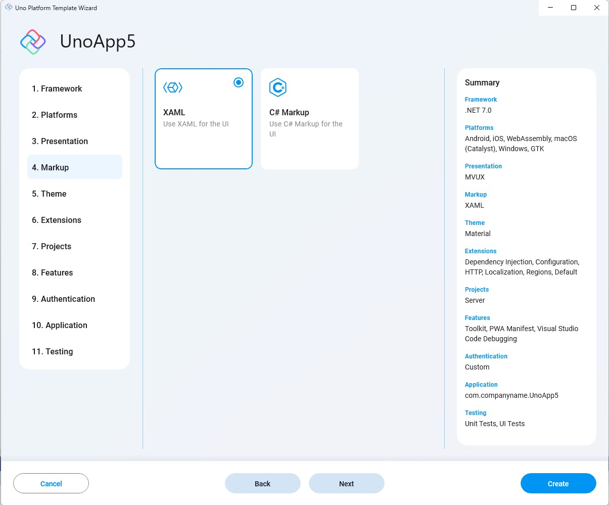

Determines the language used for UI markup.

- **XAML**  
Uses traditional WinUI XAML markup.

- **C# Markup**  
Uses the new C# Markup.  
C# Markup is a new way of defining the UI tree in C# rather than XAML.

