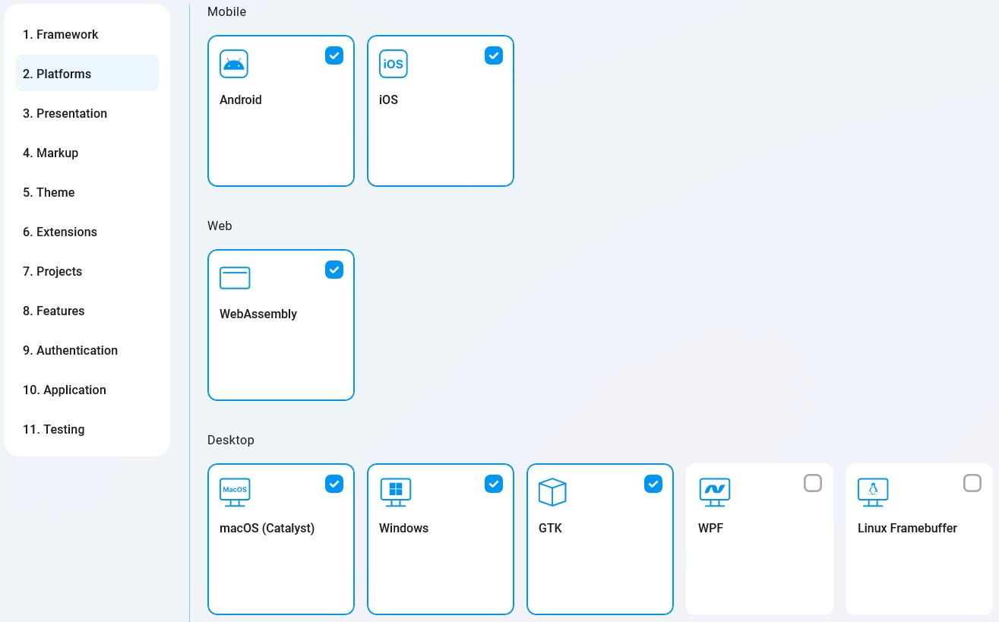

This setting lets you choose which platforms the generated app will target.
    

    
Uno Platform currently supports targeting the following operating systems:
    
- Mobile
  - Android
  - iOS
- Web
  - WebAssembly (WASM)
- Desktop
  - macOS (via Catalyst)
  - Windows
  - GTK
  - WPF
  - Linux Framebuffer
