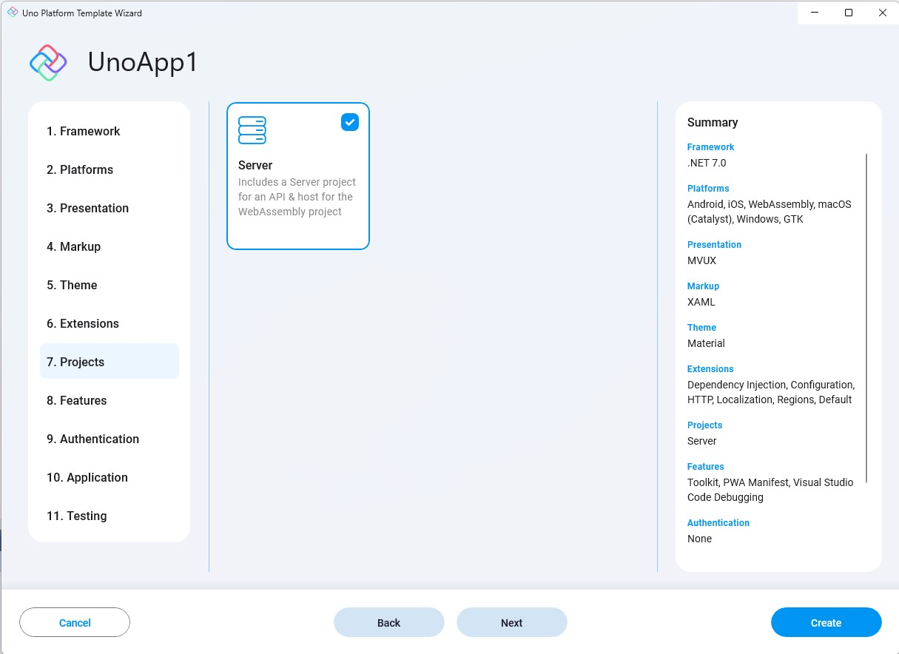

- **Server**  
    Adds an ASP.NET Core Server projects to the solution, which hosts the WASM project, and can also be used to create an API and endpoints. It can also be used as the data server as well as the authentication server. At this stage Authentication is not implemented in the server project, but this feature is being considered of being shipped with the template to reduce boilerplate code even further.

