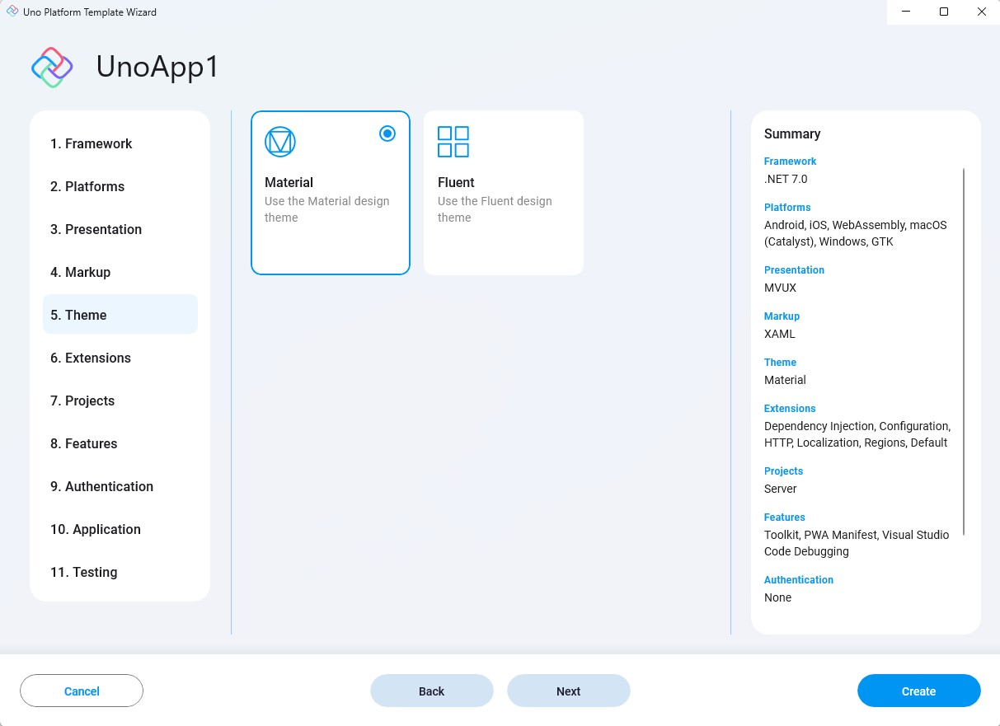

Uno platform lets you decide easily which theme or skin to display throughout your app.

This option sets the generated theme or skin to be used in the generated app. The options available are:
    
- **Material**  
    Material is Google's design system.  
    Learn more about [Material](https://material.io/).

    The generated project will have the material theme applied:

    

- **Fluent**  
    Fluent is an open-source design system that drives Windows and WinUI's default style.  
    Learn more about [Fluent Design System](https://www.microsoft.com/design/fluent/).
  
For instance, this very wizard uses the Material theme.

